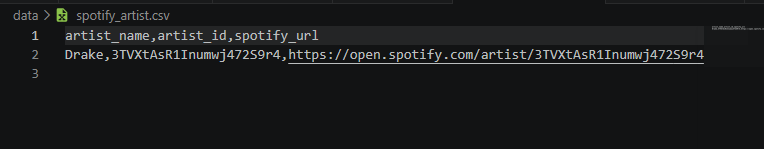

# 🎧 Spotify Data Pipeline

## 📌 Overview
This project implements a simple end-to-end data pipeline using the Spotify API.

It extracts artist data, transforms it into a structured format, and stores it for analysis.

---

## ⚙️ Pipeline
Spotify API → Extract (Python) → Transform (Pandas) → Load (CSV)

---

## 📊 Example Output

| artist_name | artist_id | spotify_url |
|------------|----------|-------------|
| Drake | 3TVXtAsR1Inumwj472S9r4 | https://open.spotify.com/... |

---

## 🛠️ Tech Stack
- Python  
- Pandas  
- REST API (Spotify)

---

## 🧠 What I learned
- Working with REST APIs  
- Building ETL pipelines  
- Data transformation with pandas  
- Structuring data for analysis  

---

## 🚀 Future Improvements
- Add multiple artists  
- Store data in SQL database  
- Automate pipeline  

## 🚀 How to run

pip install -r requirements.txt  
py scripts/extract.py